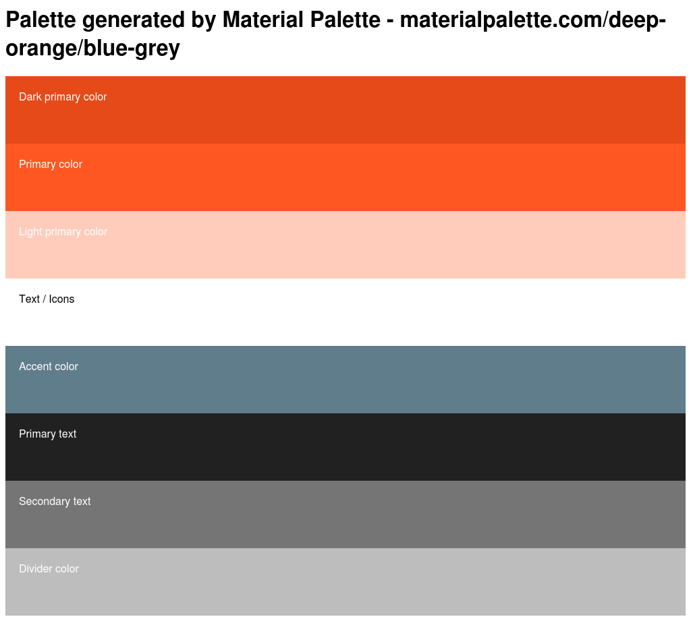

# Color

We will explore color by using some online tools to create color palettes, then we will use CSS to add those colors to our pages. 

## Palette Tools
* [Google material design palette](https://www.materialpalette.com/)
* [Paletton](http://paletton.com)

## Instructions for generating a palette

### Material design palette
Select two colors. 


Find your palette in the bottom right. Now you can export your palette in CSS (among many others).


Now we have a number of colors to use in our project. The benefit of using a color palette is that you ensure that your colors go well together -- also you can change your css to change your whole site's color scheme. 

```css
/* Palette generated by Material Palette - materialpalette.com/deep-orange/blue-grey */

.dark-primary-color    { background: #E64A19; }
.default-primary-color { background: #FF5722; }
.light-primary-color   { background: #FFCCBC; }
.text-primary-color    { color: #FFFFFF; }
.accent-color          { background: #607D8B; }
.primary-text-color    { color: #212121; }
.secondary-text-color  { color: #757575; }
.divider-color         { border-color: #BDBDBD; }
```

And here is an image of the palette. Generate this image by exporting the PNG of the palette.



I am using this color scheme for the rest of the project. 

