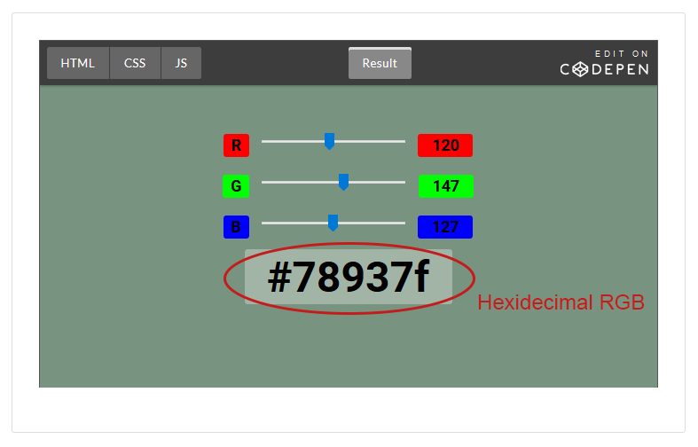

# Unit 2: Cascading Style Sheets (CSS)

## 2.1 Style

### CSS Example
In this section students will apply styles to the simple HTML file we used in the last unit. Work through the styling as a class or have students work through at their own pace.

Student documentation should include the sample HTML file with styling. The styling used in this example is *internal* styling. This will be explored more in the next section. 

Example:
```html
<!DOCTYPE html>
<html>
  <head>
    <title>Style</title>
    <style>
    body{
      background-color: gray;
    }
    p {
      font-family: Arial;
      border: solid;
      background-color: lightgreen;
    }
    h1 {
      font-family: Arial;
      color: navy;
    }
    </style>
  </head>
  <body>
    <h1>Styling HTML with CSS</h1>
    <p>
        This is the paragraph section that we will learn to style first.
    </p>
  </body>
</html>
```

### The CSS Language
#### Learning Objectives
* Students will be able to identify each part of a CSS rule: **selector, declaration, property, value**.
* Students will understand the syntax of a CSS rule including the placement of curly brackets ``` { } ```, colons ``` : ```, and semi-colons ``` ; ```. 
* Students will be able to compose CSS rules.
* Students will research CSS rules and properties.
* Students will observe the relationship between CSS rules and HTML elements

#### CSS Rules Style HTML Elements
Focus on the vocabulary: **selector, declaration, property, value**. Have students use the sample CSS example from the previous lesson to try each rule in the lesson. 
Students should create a copy of the CSS Cheat Sheet and research new properties at [W3Schools CSS Reference](https://www.w3schools.com/cssref/default.asp).

#### Documentation
Documentation for this section will be the creation of a CSS cheat sheet using Google Docs. 

### Internal, External, and Inline Styling
#### Learning Objectives
* Students can identify different types of styling. 
* Students can use inline, internal, or external CSS to style HTML.
#### Inline:
Styles are added inside HTML tags as in the following example.
```html
    <h1 style="font-family:Arial">Styling HTML with CSS</h1>
```
#### Internal
Styles are added to the HTML file, but inside a style tag in the head of the document.
```css
<style>
p {
    font-family: sans-serif;
}
</style>
```
#### External
CSS is saved in another file and referenced from the HTML file. In the following example there is an HTML file with a ```<link>``` tag and a CSS file with a CSS rule.

*index.html*
```html
<!DOCTYPE html>
<html>
<head>
  <title>Hi</title>
  <link rel="stylesheet" type="text/css" href="style.css">
</head>
  <body>
    <p>Hi everybody!</p>
  </body>
</html>
```

*style.css*
```css
p {
    font-family: sans-serif;
}
```
Here is an example of how those files would show up on the computer:

#### Documentation
Documentation for this section will be the creation of an external style sheet for the sample HTML file. Students should investigate what happens when they include an external style sheet, internal styling and inline styling in one page. They should see that external styles are overridden by internal styles which are overridden by inline styles. 

### Text Styling
#### Learning Objectives
* Students can tell the difference between a serif, sans-serif and monospace font. 
* Students will explore the different resources linked to in the lesson.

#### Typefaces
1. Serif: these typefaces have extra strokes on the ends of the lines called serifs. 
2. Sans-serif: these typefaces do not have serifs and are more modern looking.
3. Monospace: each letter is the same width. These are used on computers (like when coding in Visual Studio Code). Typewriters used monospace typefaces.
#### CSS For Styling Text
Declare  different degrees of specificity so that if the computer doesn't have the font you want it will fall back to the next best thing. 

Find more information at [W3Schools fonts page](https://www.w3schools.com/css/css_font.asp)
#### Online Font Resources
Have students find different fonts they like using the resources given in the lesson.
* [Font Squirrel](https://www.fontsquirrel.com/)
* [Google Fonts](https://fonts.google.com/)
* [CSS Font Stack](https://www.cssfontstack.com/)

#### Documentation
Students will document their learning by styling one webpage with 3 different font combinations and recording their impressions of each. Have students think about what combination of header and paragraph fonts go well together. Have students look for examples from other websites and print sources.

### CSS Selectors

#### Learning Objectives
* Students will understand the use of type, universal, class, and ID selectors.
* Students will understand the syntax of each selector type including the special characters that denote each type (```*``` for universal, ```.``` for class,  ```#``` for ID).
* Students will be able to test their code using the [codpen.io](https://codepen.io/) website.
* Students will implement CSS rules they are given.
* Students will author new CSS rules.

#### [Codepen.io](https://codepen.io/)
Familiarize yourself with the codepen website before this unit. Codepen is a website that lets you modify HTML, CSS, and JavaScript and immediately see the results. We will use codepen extensively throughout the rest of the course. Codepen has many features and we encourage teachers to explore how it could work for them. Codepen can be used without an account, however having students make accounts will allow them to save their pens.

#### Random Text and Placeholder Images
Often designers need some images and text before they have the actual copy and photos they will put in their websites. For this purpose we will use these websites:

* [Random Text Generator](http://www.randomtextgenerator.com/)
* [Placeholder](https://placeholder.com/)

#### Universal Selector
The universal selector is denoted with an asterisk ```*```, and applies the rule to every element in the HTML file.
```css
* {
  background: lightblue;
}
```

#### Class Selector
Class selectors allow designers to specify a class inside HTML tags and to create a style that will apply to every member of that class. Emphasize for students that CSS class rules start with a period and then the class name.

The following HTML tag and CSS rule are an example of defining a class in HTML then styling with CSS.

HTML  
```html
<p class="intro">This text will be styled with the intro class</p>
```
CSS
```css
.intro {
    color: white;
    background: navy;
}
```
#### ID Selector
The ID selector is used to style a unique element. Each ID should only be applied to a single element. Styling an ID selector is done by adding a hash before the id name as in the following example.
HTML  
```html
<p id="intro">This text will be styled with the intro ID</p>
```
CSS
```css
#intro {
    color: white;
    background: navy;
}
```
#### Documentation
1. Students will create a codepen account.
2. Students will create a new pen using each of the selectors to style some HTML.
3. What happens with conflicting styles? The most specific style "wins". So a class will override a universal, and an ID will override a class. The order only matters for conflicting styles of the same type, then the last one "wins."

### Assignments
1. Students will style the webpages they created in the last unit. 
    1. Create a new folder with copies of the webpages from Unit 1. They should keep the original webpages as artifacts of their work.
    2. Style "About Me" with inline styling. Styling for this page should be inside each tag.
    3. Style "Favorite Animal" using internal styling.
    4. Style "Forms Cheat Sheet" with external style sheet.
2. Codepen: Create a new page in codepen using generated text and placeholder images. Include all the selector types. You can view their pen by viewing the link copied from the browser. 


## 2.2 Color
### Color on the Computer
#### Learning Objectives

* Students will understand that each point on a monitor is a pixel.
* Students will understand that pixel color is created by setting the amount of red, green and blue light transmitted.
* Students will understand that the amount of each color is represented as a number from 0-255.
* Students will experiment using red, green and blue to create colors.
* Students will understand how numbers from 0-255 can be represented in hexadecimal notation.
* Students will apply hexadecimal numbers to specify colors. 

#### Computer Displays

Discuss with students how a monitor is made up of pixels. Have students calculate the number of pixels on various monitors. 

Pixels in a 1080p monitor: 1920 x 1080 = 2,073,600 

Pixels in a 4K monitor: 3840 x 2160 = 8,294,400

#### RGB
RGB (red, green, blue) representation of color gives each color a value from 0-255. We can then write each color as a triplet of numbers. For example (0, 0, 0) is black and (255, 255, 255) is white. Have students explore colors using the [color sliders codepen](https://codepen.io/instructionalist/live/XEOwBp). Challenge the students to find the relationships between sliders and observed colors. Observe the triplets given above for black and white. Observe the colors when each slider is at its max and the others are at 0.

Explain that the number on the bottom of the slider is the hexadecimal encoding of the RGB value.



#### Hexadecimal 

Work through converting RGB values to hexadecimal. 

#### Colors the Easy Way
Students will look up different colors in the 
[W3Schools Color Names](https://www.w3schools.com/colors/colors_names.asp)
table. Challenge students to recreate colors with the color slider. 

#### Documentation
Students will create a table of colors (at least 10) using Google Sheets. Table should have color names and RGB in hex. Encourage students to select colors they might want to  use in web pages. Emphasize that the colors that make good webpages are not often garish. 

### Color Palettes
#### Learning Objectives
* Students will understand the purpose of a color palette.
* Students will identify tools for creating color palettes.
* Students will create a color palette using online tools.
* Students will express a color palette using CSS.
#### How to Generate a Palette

Students should follow the lesson to use [Material Design Palette](https://www.materialpalette.com/) to create a new color palette and export the CSS. Challenge students to create palettes using the other tools listed. 

#### Documentation
Students should create a folder and copy their original *me.html* file from Unit 1 into the folder along with a new css file, *palette.css* where they will save their CSS from the online palette generation tool.


### Apply a Palette
#### Learning Objectives
* Students will observe application of CSS palette to HTML file. 
* Students will implement their color palette on their HTML file. 

Students will apply the color palette CSS files to their previous HTML files. They should now have a consistent color theme for their web pages. Encourage them to stick with their palette going forward.

Have students follow along with the video. 

#### Documentation
Students will style their *me.html* file using their color palette. Have students add fonts they used in previous style sheets to their CSS file. 

### Assignments
1. Generate Two Color Palettes.
  * Students should generate CSS and PNG (image) files for each.
2. Style Current Pages
  * Have students apply color palettes to all the pages from Unit 1, including About Me, Favorite Animal, and Forms Cheat Sheet.
3. Experiment and Research
  * Students create a new web page to answer the questions.
  * Students will write answers to questions about text and background color combinations. They will style the good answer using a good color combination and the bad one using a bad color combination.
  * Look for students to write about contrast and colors that don't clash. 
  * Look for students justifying their answer with online sources. 


## 2.3 Layout
### Creating Blocks with `<div>`
In this section students are going to create colored blocks using ```<div>```. Students will position each block and see how a webpage flows. Each element is given a position based on when it shows up in a page. 

#### Learning Objectives
* Students understand the use of the ```<div>``` element.
* Students implement styling using the ```<div>``` element.
* Students implement styling using descendant selectors.

#### Creating Color Blocks
Students will use [codepen.io](https://codepen.io) to create colored blocks using ```<div>``` and class styling. Make sure students save this pen as we will come back to it in the section on floats.

#### Using ```<div>```
Students should follow along and use ```<div>``` elements to style their Favorite Animal page. Into a new folder, have students copy their original, unstyled *animal.html* file and any images from Unit 1. In the same folder, have students create a new *style.css* file. They should then add a link tag to the head of their html file.
```html
<link rel="stylesheet" type="text/css" href="style.css">
```

If possible, have students print off a copy of their original Favorite Animal web page so they can mark the logical sections as in the lesson.  

Students should then be able to follow along with the video to add <div> elements to the appropriate sections on their own web page. 

Once students have added ```<div>``` elements they should follow along with the lesson to apply styling to the different sections. 

#### Documentation
1. Codepen with red, blue and green boxes.
2. New *animal.html* and style.css file with ```<div>``` element styling.

### Positioning with Float
Using float, students will learn how to bring objects out of the standard flow. This can be used to position images so that text flows around them. Also we will use float to make a grid of different color blocks. 
#### Learning Objectives
* Students can identify CSS code to position items using float.
* Students can write CSS code to position items using float.

### Float Left
Students will use the codepen from the previous lesson to learn about the float property. We will start by adding a ``` float:left``` to the box class to see what happens. Then students will experiment by trying ```float:right```. 

#### Documentation
Students should find the CSS needed to generate each configurations of boxes shown in the lesson. 

1. 
```css
.box {
  height: 100px;
  width: 100px;
  float: left;
}
.red {
  background: red;
}
.blue {
  background: blue;
}
.green {
  background: green;
}
```
2.
```css
.box {
  height: 100px;
  width: 100px;
}
.red {
  background: red;
  float: left;
}
.blue {
  background: blue;
  float: right;
}
.green {
  background: green;
  float: left;
}
```
3.
```css
.box {
  height: 100px;
  width: 100px;
}
.red {
  background: red;
  float: right;
}
.blue {
  background: blue;
  float: right;
}
.green {
  background: green;
  float: left;
}
```


### Assignments
1. Style all pages from Unit 1 using ```<div>``` elements. 
2. Create a wire-frame page design and create a webpage with each section of the wire-frame identified with a ```<div>``` element. 
3. Challenge: Use floats to layout the webpage as it is in the wire-frame. For this students will have to research clearing float to get content below floated elements. A sample of this can be found in [this codepen](https://codepen.io/instructionalist/pen/pZLXOr?editors=1100#). Look for this line:
```html
<div style="clear: both;"></div>
``` 
An empty div with an inline style ```clear: both;``` will let content resume normal document flow after floating elements.  

## 2.4 Boxes
### Box Dimensions
#### Learning Objectives
* Students will understand the difference between absolute and relative measurements
* Students can author CSS to specify dimensions.
* Students can infer absolute measurements from relative measurements
#### Documentation
1. If a paragraph is 80% of the body, which is 680 pixels wide, then the paragraph is 0.8 x 680 = 544 pixels.
2. Center text with this rule:
```css
p {
  text-align: center
}
```
3. ```height: 800px```


### Margins, Borders, and Padding
#### Learning Objectives
* Students will identify content, padding, border and margin
* Students will modify padding, border and margin using CSS
#### Documentation
Students will use codepen to create paragraphs with at least 3 different border styles. See [border property] for different border styles. 

### Assignments
In this section students will make a portfolio site that will show the pages they have done so far. This will be a front page that will have navigation to each webpage they have made. The new front page will use HTML5 and be styled with CSS. This project should take some time and should involve an iterative process. Students should create a portfolio website, get feedback from the instructor or other students and revise. Student portfolio sites should link to all their work so far in the course.


