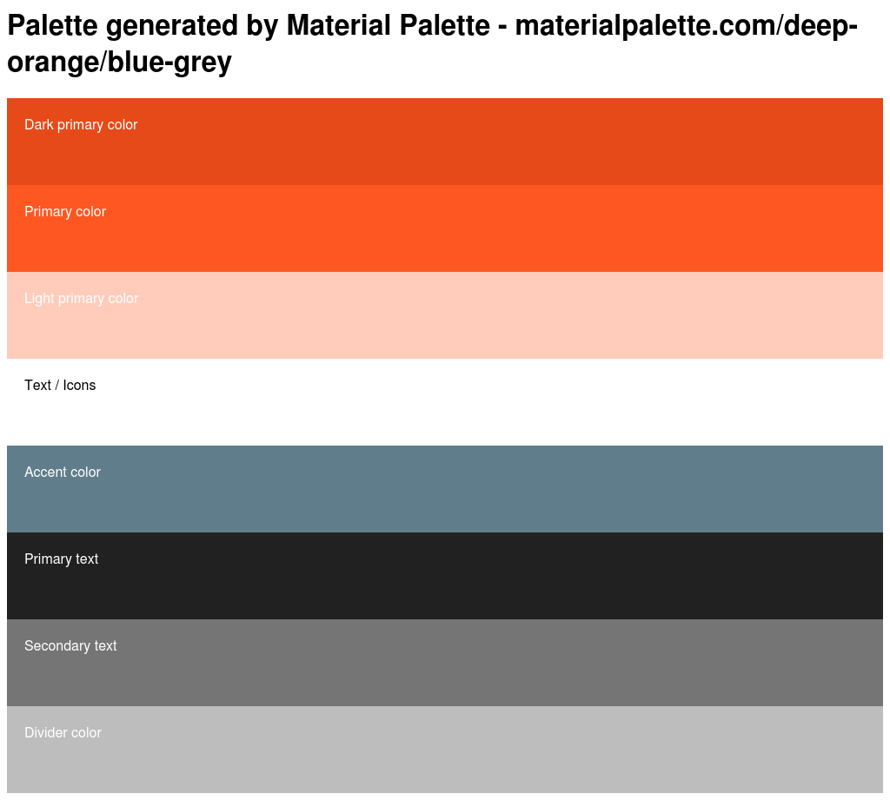

# Color

We will explore color by using some online tools to create color palettes, then we will use CSS to add those colors to our pages. 
```html
<iframe scrolling="no" title="rgb color sliders" src="https://codepen.io/instructionalist/embed/XEOwBp?height=265&theme-id=0&default-tab=result&embed-version=2" frameborder="no" allowtransparency="true" allowfullscreen="true" style="width: 100%;"></iframe> 
```


## Palette Tools
* [Material Design Palette](https://www.materialpalette.com/)
* [Paletton](http://paletton.com)
* [Google Material Design: Color Tool](https://material.io/color/)

## Instructions for generating a palette

### Material design palette
Select two colors. 


Find your palette in the bottom right. Now you can export your palette in CSS (among many others).


Now we have a number of colors to use in our project. The benefit of using a color palette is that you ensure that your colors go well together -- also you can change your css to change your whole site's color scheme. 

```css
/* Palette generated by Material Palette - materialpalette.com/deep-orange/blue-grey */

.dark-primary-color    { background: #E64A19; }
.default-primary-color { background: #FF5722; }
.light-primary-color   { background: #FFCCBC; }
.text-primary-color    { color: #FFFFFF; }
.accent-color          { background: #607D8B; }
.primary-text-color    { color: #212121; }
.secondary-text-color  { color: #757575; }
.divider-color         { border-color: #BDBDBD; }
```

And here is an image of the palette. Generate this image by exporting the PNG of the palette.



I am using this color scheme for the rest of the project. 

## Feature List
## Variables
* preprocessor variables
* custom processors
* css variables 
    * update the value from with a file

```css
:root{
    --font-color = black;
}
```

## Blending and filtering

## Shapes
* css shapes editor extension
* clip-path
    * bennetfeely/clippy

## new color values
* 8 digit hex, last 2 are alpha (00 transparent, FF opaque)
* color-mod()
    * hue
    * lightness
    * . . .

## To Do
1. Moved most of the content of this into HTML5 Section. 
2. Redo this index.html just using these colors. Maybe build the site with just `<div>`

