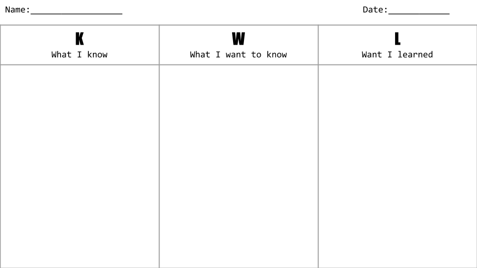

# Unit 3: Libraries and Advanced Web

## 3.1 CSS Flexbox

### Learning Objectives
* Students can use Flexbox to layout web pages.
* Students can research features of CSS.
* Students understand increased levels of abstraction allow more complicated layouts with less code.
* Students can identify abstractions such as grow-to-fit and relative sizing. 

### Flexbox Simple Sample
Students should make new files *index.html* and *style.css* in their own new 3.1_Flexbox folder.  
#### Make a Sample HTML
Students create a sample HTML file they will use to style with flexbox. The walk through starts with an empty HTML file then fills the sections with randomly generated text and placeholder images. There are many sites that provide sample content. Here are the ones we used in the previous unit:
* [Random Text Generator](http://www.randomtextgenerator.com/)
* [Placeholder](https://placeholder.com/)

Have students look up the ```<article>``` and ```<section>``` tags. 
```html
<!DOCTYPE html>
<html>
<head>
<title>Flex Simple Sample</title>
<link rel="stylesheet" href="style.css"> 
</head>
<body>
<header><h1>Flexbox Simple Sample</h1></header>
<section>
  <article>
    <h2>First Article</h2>
    <p>. . . . . . . . . . random text . . . . . . . . . . </p>
  </article>
  <article>
    <h2>Second Article</h2>
    <p>. . . . . . . . . . random text . . . . . . . . . . </p>
  </article>
  <article>
    <h2>Third Article</h2>
    <p>. . . . . . . . . . random text . . . . . . . . . . </p>
  </article>
</section>
</body>
</html>
```
#### Make a Sample CSS
Students make a sample CSS file. Students should create the CSS file shown. Then once they have saved both their HTML and CSS files have them open *index.html* in their browser.
```css
body {
    font-family: sans-serif;
}
header {
    background: navy;
    height: 100px;
    color: white;
}
h1 {
    text-align: center;
    line-height: 100px;
}
article {
    padding: 10px;
    margin: 10px;
    background: lightblue;
}
```
#### Create Flex Container
Students add flexbox containers to their files. The following CSS rule added to the end of the CSS file will make the section into a flex container.
```css
section {
    display: flex;
}
```
Have students save and reload their files. Now the random text should be arranged in a row instead of vertically. 
#### Documentation
Students should have a new *index.html* and *style.css* file to share.

### Flexbox Terminology
#### Containers and Items
Review the vocabulary of **items** and **containers**, emphasizing that items go in containers. Take time to review the image at the start of the lesson. Here are some good flexbox references:
* [A Complete Guide to Flexbox](https://css-tricks.com/snippets/css/a-guide-to-flexbox/)
* [W3Schools CSS Flexbox](https://www.w3schools.com/css/css3_flexbox.asp)
* [Basic concepts of flexbox](https://developer.mozilla.org/en-US/docs/Web/CSS/CSS_Flexible_Box_Layout/Basic_Concepts_of_Flexbox)

#### Container Properties
Have students look up the listed properties and write down the purpose of each property.

Property | Purpose
-|-
display | set to flex, creates a flexbox container
flex-direction | tells the items which way to go
flex-wrap | allow items to wrap to the next line
flex-flow | set both direction and wrap
justify-content | align flex items horizontally
align-items | align flex items vertically
align-content | aligns multiple lines of flex items


#### Item Properties
Have students look up the listed properties and write down the purpose of each property.

|Property | Purpose
|-|-
|order| set the order of flexbox item
|flex-grow | set the amount a flex item is allowed to grow 
|flex-shrink | set the ability of a flex item to shrink
|flex-basis | set the size of an element before using remaining space
|flex | shortcut for specifying flex-grow, flex-shrink and flex-basis
|align-self | change alignment of a single item

#### Example on Codepen
This codepen is a good one to review as a class. As a class or in small groups have students explain what every element in the HTML and CSS do. Here are the parts to review.
##### HTML
The HTML in this codepen is only enough to illustrate some flexbox principles. 
```html
<section>
  <article id="one"><p>I</p></article>
  <article id="two"><p>II</p></article>
  <article id="three"><p>III</p></article>  
</section>
``` 
This creates a single section with three articles inside. The HTML5 ```<article>``` and ```<section>``` elements act like named ```<div>``` elements.
##### CSS
The CSS for this codepen styles all the elements. Take time to go through each line and discuss as a class or in small groups what each line does. Have students locate flexbox lines. Flexbox lines are identified here with comments.
```css
section {
  display: flex; /* Create the top level flex container */
  background: lightgrey;
  padding: 10px 10px 10px 10px; 
}
article {
  background: maroon;
  height: 100px;
  margin: 10px;
  display: flex; /* Create flex container inside flex item */
  justify-content: center; /* Center content horizontally */
  align-items: center; /* Center content vertically */
}
#one {
  order: 1; /* Set order of item */
  flex-grow: 1; /* Set size of item */
}
#two {
  order: 2; /* Set order of item */
  flex-grow: 2; /* Set size of item */
}
#three {
  order: 3; /* Set order of item */
  flex-grow: 1; /* Set size of item */
}
p {
  margin: 0px;
  padding: 0px;
  font-size: 36px;
  color: white;
}
```
Note that both ```section``` and ```article``` are styled as flexbox containers. This means that while the ```section``` is a flexbox container, the ```article``` is both a flexbox item inside the ```section``` and a flexbox container. The individual ```p``` elements are items inside each ```article``` container.

#### Documentation
Research and figure out how to perform the following modifications to the codepen. 

1. How do you change the order? 
    * Modify the order number in the rules for ```#one```, ```#two``` and ```#three```. 
    * Have students create 3 different orders.
2. How do you change the size?
    * Modify the flex-grow number in the rules for #one, #two and #three. The height can be changed by modifying ```height``` in the ```article``` rule.
    * Have students create 3 different sizings.
3. How do you make the flexbox container order the items vertically?
    * Add ```flex-direction: column``` to the ```section``` rule.

### Applying Flexbox
#### *index.html* 
```html
<!DOCTYPE html>
<html>
<head>
<title>Flex Simple Sample</title>
<link rel="stylesheet" href="style.css"> 
</head>
<body>
<header><h1>Flexbox Simple Sample</h1></header>
<section>
  <article>
    <h2>First Article</h2>
    <p>. . . . . . . . . . random text . . . . . . . . . . </p>
  </article>
  <article>
    <h2>Second Article</h2>
    <p>. . . . . . . . . . random text . . . . . . . . . . </p>
  </article>
  <article>
    <h2>Third Article</h2>
    <p>. . . . . . . . . . random text . . . . . . . . . . </p>
  </article>
</section>
</body>
</html>
```
##### *style.css*
```css
body {
    font-family: sans-serif;
}
header {
    background: navy;
    height: 100px;
    color: white;
}
h1 {
    text-align: center;
    line-height: 100px;
}
article {
    padding: 10px;
    margin: 10px;
    background: lightblue;
}
```
#### Adding More Flex
Students will add the following features using flexbox:

* Three images above the articles
* Even spacing of articles 
* Sidebar
* Footer

#### Create a Container for Images
Students will add sections for images and use [placeholder]() images to test their code. The added section code is shown in the lesson images. Here is the code that should be added between the ```<header>``` and ```<section>``` lines:
```html
<section>
  <article>
  
  </article>
  <article>
  
  </article>
  <article>
  
  </article>
</section>
```

#### Even Spacing
Students will modify article CSS to make the images spaced out evenly. Students might observer that if their randomly generated text articles are of different lengths, then they aren't evenly spaced. Emphasize that ```flex-grow:1``` does not force ```article``` elements to be the same size, instead it equally shares the remaining space. We will fix this in the next section.
```css
article {
    padding: 10px;
    margin: 10px;
    background: lightblue;
    flex-grow: 1;
}
```

#### Flex Shorthand
Students will replace ```flex-grow: 1``` declarations with the shorthand ```flex: 1```. This gives flexbox more responsibility to "figure out" how to space things perfectly.  
```css
article {
    padding: 10px;
    margin: 10px;
    background: lightblue;
    flex: 1;
}
```

#### Add a Sidebar
To add the sidebar we are first going divide the pages into ```<div>``` elements. Surround the sections containing the images and articles with a div of class "content".
```html
<div class="content">
<!-- all sections so far go in here -->
</div>
```
See the in lesson animation for more detailed instructions.
Create a new div above this with class "sidebar".
```html
<div class="sidebar"></div>
```
Add an image and a short list to the sidebar. Sidebar HTML should look like this:
```html
<div class="sidebar">
  
  <ul>
    <li>Thing 1</li>
    <li>Thing 2</li>
    <li>Thing Red</li>
    <li>Thing Blue</li>
  </ul>
</div>
```
Have students save and look at their page. It should look similar to the image in the lesson. The sidebar is not on the side yet. To do this we need to put the sidebar and the content into their own flex container. Do this by surrounding the sidebar and content divs in a ```<section>``` element as shown in the lesson animation.

#### Add a Footer
Add a footer using ```<footer>``` HTML5 tag. 
```html
<footer>
    <h3>This is a footer.</h3>
</footer>
```
Place this at the bottom between the last section end tag and the body end tag. 

Create some styling for the footer in the stylesheet.
```css
footer {
    background: navy;
    color: white;
    height: 60px;
}
```

#### Documentation 
Have students turn in their completed *index.html* and *style.css*.


### Assignments
1. Implement a Wire-frame with Flexbox
    * Have students draw a wire-frame for a website, either their own or copying a popular website. 
    * Each section on the wire-frame should be labeled.
    * Students create a new HTML and CSS file for their assignment. 
    * Each section of the wire-frame should correspond to a div or other section in the HTML code.
    * Each section should be styled in the CSS file. 
    * Sections should be positioned using flexbox.
2. Challenge: Bar graph
    * Students create a new flexbox project and create a bargraph using flexbox. Here is an example in one HTML file:

```html
<style>
#axes {
    display: flex;
    height: 400px;
    align-items: flex-end;
}
.bar {
    flex-grow: 1;
    margin: 10px;
    background: maroon;

}
.b2 {
    height: 40%
}
.b3 {
    height: 45%
}
.b4 {
    height: 90%
}
.b5 {
    height: 10%
}
.b6 {
    height: 77%
}
.b7 {
    height: 85%
}
.b8 {
    height: 10%
}
</style>
<div id="axes">
    <div class="bar b1">1</div>
    <div class="bar b2">2</div>
    <div class="bar b3">3</div>
    <div class="bar b4">4</div>
    <div class="bar b5">5</div>
    <div class="bar b6">6</div>
    <div class="bar b7">7</div>    
</div>
```

## 3.2 CSS Grid
### Learning Objectives
* Students can use CSS Grid to layout web pages.
* Students can research features of CSS.
* Students understand increased levels of abstraction allow more complicated layouts with less code.
* Students can identify abstractions such as grid areas, grid tracks, and fractional.


CSS Grid allows designers to create responsive layouts easily using just CSS. Responsive layouts are webpages that resize depending on the size of the screen used to view them. Devices ranging from smartwatches to large monitors need to be able to view your sites. In this unit students will learn to create responsive websites.  

### Sample Grid
Students will create a new index.html and style.css file in a 4.3_cssgrid folder. Have students walk through the lesson creating the simple sample. 

To make the grid container use the ```display: grid``` property.

In this section we introduce a new unit for dividing up parts of a page. The unit is ```fr``` and stands for fraction. 

The grid is created with ```grid-template-rows```
and ```grid-template-columns``` properties. These in combination with the ```fr``` unit are how we create the grid in this sample. 

#### Documentation
1. Students will look up how to center text. This is not a grid specific CSS property. The necessary CSS is shown below. 
```css
.cell {
    text-align: center;
}
```
2. Students turn in *index.html* and *style.css* for this unit. These files will look like those shown below.
##### *index.html*
```html
<!DOCTYPE html>
<html>
<head>
  <title>CSS Grid Simple Sample</title>
  <link rel="stylesheet" href="style.css">
</head>
<body>
  <div class="container">
    <div class="cell">One</div>
    <div class="cell">Two</div>
    <div class="cell">Three</div>
    <div class="cell">Four</div>
    <div class="cell">Five</div>
    <div class="cell">Six</div>
  </div>
</body>
</html>
```
##### *style.css*
```css
body {
    font: 2em/4em monospace; 
}
.container {
    background: skyblue;
    display: grid;
    grid-template-rows: 1fr 1fr;
    grid-template-columns: 1fr 1fr 1fr;
}
.cell {
    border: solid blue;
    text-align: center;
}
```


### Grid Basics
In this section students will learn terms used in describing CSS grids. 

#### Grid Containers, Items, Cells and Areas
In this lesson, make sure students are using the vocabulary of grids: **containers**, **items**, **cells**, **areas**. Review the diagram in this topic with your class. Make sure they understand **rows** and **columns**. 

#### Define a Grid 

Have students look up the [**grid-template-rows**]() and [**grid-template-columns**]() and see the various values they can take. Students will mostly use length or auto settings. Remind students about setting sizes with pixels or percentages. Here is an example of a container with two rows and three columns.
```css
.some_container{
    display: grid;
    grid-template-rows: 24px 24px;
    grid-template-columns: 100px 100px 100px;
}
```

#### [Grid Cell on Codepen](https://codepen.io/instructionalist/pen/VBEyGV)

This codepen is a sample of a simple grid. Have students explore this codepen individually or as a group and determine what each line does. 
* Groups create a KWL chart.
    1. K (know) &mdash; What do you know? Students list what they know about the HTML and CSS code they see in the codepen
    2. W (Want to know) &mdash; What do you want to know? What do you see that you don't recognize?
    3. L (What did you learn) &mdash; Have students research the items from the W column and fill in items in the L column.
    4. Students can share their individual KWL within a group, or their group KWL charts with the class. 
    

[Sample KWL Chart](https://docs.google.com/presentation/d/1KEFEb2INElFabfXnkRNALIkBp28fK8xL1hN-3e9Nmfs/edit?usp=sharing)    


#### Dissecting the Code
Once students have completed their KWL Charts, have them follow along in this section. Make sure students pay special attention to **fr** units. 
#### Documentation
Students should modify the codepen to move the red square to the bottom right. The modified CSS is shown below. 
```css
#color {
  background: red;
  grid-column: 3;
  grid-row: 3;
}
```

Optionally collect completed KWL charts.

### Grid Template
Have students follow along with the lesson creating a new *index.html* and *style.css* file. Emphasize the new properties they will be using called **grid-template-areas**. This is used to create named areas that can be assigned to different HTML elements. In this lesson students create a relatively simple page that has a sidebar, a large content area, and a footer. However, this method can be used to create much more intricate pages. Here is the code used in this section
```html

```
```css

```

### Assignments

