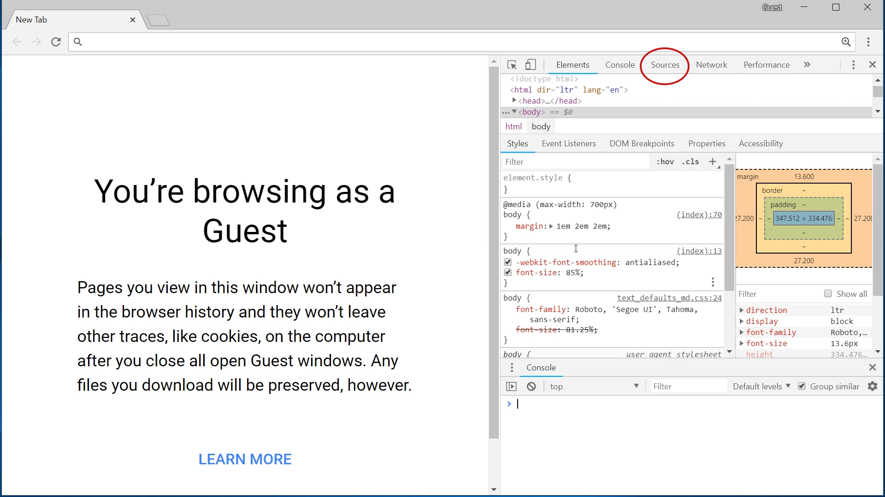

# Unit 4: JavaScript

## 4.1 Introduction to JavaScript

### Hello World

#### Learning Objectives

* Students recognize script tag.
* Students differentiate JavaScript from HTML

#### hello.html

Students create a *hello.html* file following the sample. Bring special attention to the ```<script>``` tag. The code between the start and end tag is JavaScript. Emphasize that the script tag allows you to write JavaScript inside HTML files. There are only two lines of JavaScript in the *hello.html* file. 

#### Documentation

1. Create a *style.css* file and make a style rule for the Hello World text.
    * The Hello World text is h3 text, so will be styled with an h3 rule. For example:
    ```css
    body {
        background: navy;
    }
    h3 {
        color: white;
        font-family: Consolas, Monotype;
    }
    ```
2. Change the text displayed in the JavaScript.
    * Change the text in the ```var hello = 'Hello World!';``` line. For example:
    ```javascript
    var hello = 'This is some new text';
    document.write()
    ```
### Guessing Game Get Started

#### Learning Objectives

* Students can modify a sample HTML file using vscode.
* Students can identify JavaScript in an HTML file.
* Students can interpret the purpose JavaScript variables.
* Students can implement an **alert()** function.

#### [Guessing Game](https://dylansf.github.io/webdesign/4.1_intro_to_js/guessing.html)

Have students play the [guessing game](https://dylansf.github.io/webdesign/4.1_intro_to_js/guessing.html). Ask students to explain what the game is doing. Once students have a good understanding of how the game works move on to the next section.

#### Step List

Go through the list of steps the program needs to take. This is what students will implement. Have students identify where each step is happening in the game.

#### Sample Page

Students should start with the sample HTML file. The file can be copied from [here](https://github.com/STEM-Fuse/learning-area/blob/master/javascript/introduction-to-js-1/first-splash/number-guessing-game-start.html). Have students locate the part of the HTML file with the comment 

```html
<script>
    // Your JavaScript goes here
</script>
```

Instruct students to put all their code between these tags. 

Students now save and view their *guessing.html* file in the browser. Have students follow along in the lesson adding the JavaScript shown.

#### Documentation

Students should have a *guessing.html* file that looks like this:

```html
<!DOCTYPE html>
<html>
  <head>
    <meta charset="utf-8">

    <title>Number guessing game</title>

    <style>
      html {
        font-family: sans-serif;
      }
      body {
        width: 50%;
        max-width: 800px;
        min-width: 480px;
        margin: 0 auto;
      }
      .lastResult {
        color: white;
        padding: 3px;
      }
    </style>
  </head>

  <body>
    <h1>Number guessing game</h1>

    <p>We have selected a random number between 1 and 100. See if you can guess it in 10 turns or fewer. We'll tell you if your guess was too high or too low.</p>

    <div class="form">
      <label for="guessField">Enter a guess: </label><input type="text" id="guessField" class="guessField">
      <input type="submit" value="Submit guess" class="guessSubmit">
    </div>

    <div class="resultParas">
      <p class="guesses"></p>
      <p class="lastResult"></p>
      <p class="lowOrHi"></p>
    </div>

    <script>
        var randomNumber = Math.floor(Math.random() * 100) + 1;

        var guesses = document.querySelector('.guesses');
        var lastResult = document.querySelector('.lastResult');
        var lowOrHi = document.querySelector('.lowOrHi');

        var guessSubmit = document.querySelector('.guessSubmit');
        var guessField = document.querySelector('.guessField');

        var resetButton;

        function checkGuess() {
            alert('I am a function called checkGuess()')
        }

    </script>
  </body>
</html>
```

When students run the checkGuess() function from the developer console, they should see an alert box with the alert text. To change the alert text, students will modify the checkGuess() function. For example:

```javascript
function checkGuess() {
    alert('Here is some other alert text')
}   
```

### Guessing Game Variables

#### Learning Objectives

* Students understand the purpose of the variables in *guessing.html*.
* Students observe the syntax for variables in JavaScript.
* Students use the development console.
* Students test functions in the development console.

#### Variables so Far

Individually, in groups, or as a class go through the script so far. Read what each section of variables does. Discuss the various document functions and have students identify what they recognize.

Have students theorize on what the `document.querySelector()` function does.

#### Documentation

1. Run `Math.random()` in the console. Why couldn't we use these numbers as is for the guessing game?
    * These are decimal numbers with lots of digits of precision. We could not guess the exact number.
2. Perform the next operations on Math.random(). Run `Math.random() * 100`. Why do we multiply 100?
    * Our original number is between 0 and 1. Multiplying by 100 is how we get a number between 0 and 99.999999.
3. Run `Math.floor(Math.random() * 100)`. What does Math.floor() do?
    * Math.floor() rounds down. So 45.6723 becomes 45 and 99.9999 becomes 99.
4. Run `Math.floor(Math.random() * 100) + 1`. Why add 1 at the end?
    * We add 1 so our numbers are between 1 and 100, instead of 0 to 99.

### Guessing Game checkGuess()

#### Learning Objectives

* Students can identify JavaScript functions.
* Students can identify where JavaScript implements logical steps.
* Students can implement JavaScript from an example.
* Students can find and correct any errors.

#### Creating the Program Logic

Have students follow along with the lesson about how to create the `checkGuess()` function.

#### Documentation

With your developer console open, try different things with your game. Write down behaviors that you would like to change and errors that show up in your console. Can you figure out a way to use the console to "cheat" at the guessing game?

    * Using the console, students can get the number directly by typing `randomNumber` in the console.

### Assignments

#### 1. Create a Simple JavaScript Page

Create a copy of one of your webpages from a previous unit. Add a JavaScript component using a `<script>` element.

#### 2. Style the Guessing Game

Create a new web page for the guessing game. Add your own style and text to the game. Add color, images, instructions, fonts and other styled elements.

#### 3. Create gameOver() Function

Right now the game ends and nothing happens. Create a gameOver() function that will reset the game. Start by listing what a gameOver() function should do, then try to implement your logic in a simple function.

Sample gameOver() function:

```javascript
function gameOver() {
    guessField.disabled = true;
    guessSubmit.disabled = true;
    resetButton = document.createElement('button');
    resetButton.textContent = 'Start new game';
    document.body.appendChild(resetButton);
    resetButton.addEventListener('click', resetGame);
}
```

It should not be expected that students will reach this function on their own at this point. Students should be able to describe what they want the gameOver() function to do and research ways to implement these ideas.

Once students have tried to implement their own ideas, give them the sample code above and ask them to implement it in their code. Ask them to explain what they think each line does.

## 4.2 Programming Fundamentals

### Turning in Console content:

There are many ways to get the content of the console for review. Here are two possible ways.

#### Method 1: Screen Shots

1. Create a Word or Google doc.
2. Take a screenshot of the console. With the console in full screen mode, press the Print Screen key. This copies an image of the screen to the clipboard.
3. Click inside the document and use Ctrl-V (or right click > paste) to paste in the image.
4. Have students paste screenshots of each section in their document, then share their document for assessment.

#### Method 2: Console Log File

The console can create a log file. Open the log file in Visual Studio Code (in Notepad the log shows up as one long line). The output is a complete record of the console history.

1. Have students right click inside their console and save console log file.
2. Have students share the output file, typically ```console.log`` or similar name.
3. Open ```console.log``` file with Visual Studio Code

### Variables

#### Learning Objectives
* Students can identify JavaScript syntax errors.
* Students can test code in the Chrome development console.
* Students can create variables.
* Students can differentiate between types of data.

Students will learn how to **declare** and **assign** variables. 
Here we are going to store different kinds of things is variables and then print them out. We can use a button webpage -- maybe and input to variable to modify to output.

#### Declare Variables

```javascript
var myVariable;
```

#### Assign Variables

```javascript
myVariable = 10;
```

#### Data Types

```javascript
// Numeric Data type
myNumericVariable = 0.75;

// String Data type
myStringVariable = 'This is some text';

// boolean Data type
myBooleanVariable = true;
```

#### Store a Number in a variable

```javascript
var area;
var width;
var height;

width = 6;
height = 3;
area = width * height;

// print to some html
var el = document.getElementById('area');
el.textContent = area + ' square inches';
```

#### Declare and Assign Variables in One Line

```javascript
var days = 365;
```

#### Store a String in a variable

```javascript
// Enclose string in single quotes
var animal = 'Mantis Shrimp';

// Enclose string in double quotes
var song = "Rocket Man"

// Put quotes in a string by escaping with backslash
var sentence = "JFK said \"Ask not what your country can do for you . . . \""
```

#### Store a Boolean value in a variable

```javascript
var isInClass = true;
 
// change a variable later in the code
isInClass = false;
```

#### Arrays

* Store an array in a variable

```javascript
var colors;
colors = ['red', 'green', 'blue'];

// Colors array declared another way
var colors = new Array('red', 'green', 'blue');

// Arrays can be numbers
var numbers;
numbers = [1, 2, 5, 12, 19];
```

* Read from an Array

#### Documentation

1. Try all the code introduced in this lesson.
2. Save your console by right clicking on the console and selecting "Save As".

### Operators and Expressions

#### Learning Objectives
* Students can perform calculations in JavaScript.
* Students can identify arithmetic operators.
* Students can identify comparison operators.
* Students can author expressions using operators.
* Students can predict the outcome of expressions.
 
#### Arithmetic

In this section students will learn how to use JavaScript as a calculator. A good way to motivate using computers to help with calculations is this [TED Talk from Conrad Wolfram](https://www.ted.com/talks/conrad_wolfram_teaching_kids_real_math_with_computers#t-256521).
Watch the video beforehand to make sure it is appropriate for your students.

| Operator   |   Description | Example| | |
|------------|---------------|---------:|:-:|:--|
| + | Addition | 3 + 4 |=| 7 |
| - | Subtraction | 9 - 5 |=| 4|
| * | Multiplication | 8 * 3 |=| 24|
| / | Division | 12 / 3 |=| 4|
| % | Modulus (remainder) | 7 % 3 |=| 1|
| ++ | Increment | 4++ |=| 5 |
| -- | Decrement | 3-- |=| 2 |
| ** | Exponent | 3 ** 2|=|9
For more information see [W3Schools Operator Reference](https://www.w3schools.com/jsref/jsref_operators.asp).

#### Expressions

Expressions evaluate into values
An expression is a statement that puts some information into a variable. Simple expressions assign a value to a variable. More complicated expressions can use two or more values to decide what to put in a variable.

```javascript
// This expression assigns a value to a variable
var name = 'Hodor';

// This expression uses 2 values to determine the value of a variable
var hoursPerWeek = 24 * 7;
```

#### Other Operators

| Operator   |   Description | Example| Result |
|------------|---------------|---------|--|
| = | Assignment | x = 13 | sets x to 13 |
|**Comparisons** | Tests return true or false 
| == | Equal to | x == 13 |true|
|    |          | 1 == 2  |false
| != | Not equal to | x != 13 |false|
|    |          | 1 != 2  |true
| > | Greater than | x > 12 |true|
|    |          | 10 > 12  |false
|    |          | 1 > 1  |false
| >= | Greater than or equal to| x >= 13 |true|
|    |          | 13 >= 22  |false
| < | Less than | x < 13 | false |
|    |          | 1 < 2  |true
| <= | Less than or equal to |  x <= 13 | true
|    |          | 12 <= 2  |false

#### Documentation

1. Come up with a sample calculation using each operator. Confirm it does what you expect using the dev console.
2. Use variable named *x*, *y* and *z*  to store different values. Create the values from expressions that have two or more values combined with operators.
3. Use each comparison operator with your *x*, *y* and *z* variables to create at least one true and one false outcome for each comparison operator.  

### Conditionals

#### Learning Objectives
* Students can give real world examples of conditionals.
* Students understand how a program uses conditionals.
* Students can identify the *expression* and *statement* in JavaScript
* Students can implement conditionals in JavaScript

#### If Statements

```javascript
if (userGuess == randomNumber) {
    // put all the right guess code in here
    lastResult.textContent = 'You are right! You read my mind!';
    lastResult.style.backgroundColor = 'green';
    gameOver();
}
```

```javascript
if (userGuess == randomNumber) {
    // put all the right guess code in here
    lastResult.textContent = 'You are right! You read my mind!';
    lastResult.style.backgroundColor = 'green';
    gameOver();
} else {
    // put all the wrong guess code in here
    lastResult.textContent = 'Wrong!';
    lastResult.style.backgroundColor = 'red';
    if(userGuess > randomNumber) {
        lowOrHi.textContent = 'Your guess was too high';
    } else if(userGuess < randomNumber) {
        lowOrHi.textContent = 'Your guess was too low';
    }
}
```

#### Documentation

Students will author JavaScript conditional statements using Chrome snippets. To navigate to snippets in Chrome, first open Developer Tools (Ctrl+Shift+I), then find the **Sources** tab at the top of the Developer Tools window. 


## 4.3 Snake Game

### Play Snake

Have students navigate to this [codepen](https://codepen.io/instructionalist/pen/eKdvqa) and play the snake game.
#### Learning Objectives
* Students can deduce rules of a game from observation.
* Students can test software.

#### Documentation

1. What are the rules of Snake?
2. What happens when a snake reaches the edge?
3. What happens when a snake eats an apple?
4. What happens when a snake runs into its tail?

### Create *snake.html*

#### Learning Objectives
* Students can follow along with video instruction.
* Students can implement code they are unfamiliar with.
* Students can troubleshoot their code.


Have students follow along with the video for creating their snake game.

#### Snake Video

Let's create a snake game using HTML and JavaScript. We will use an HTML element called `<canvas>` to create a spot for our game. We are going to give the canvas an id of "game" with a width and height of 400 pixels.

Now we will create a script element where we will put all our JavaScript.

```html
<canvas id="game" width="400" height="400"></canvas>
<script>
```

Now we are going to create a javascript function that will run every time our window opens. This function starts by creating a variable that will refer to the canvas element in our HTML file. We use the getElementById, to get the canvas, that we gave the ID to game.

CTX is a context that gives us some rules for drawing on our canvas.

Then we add the event listener, to check for key presses. Then it will run the keyPush function.

Finally we are going to use the set interval function to update our game. We are going to set it to run 15 times a second (slow this down for easier play).

```javascript
window.onload=function() {
    canvas=document.getElementById("game");
    ctx=canvas.getContext("2d");
    document.addEventListener("keydown", keyPush);
    setInterval(game_function,1000/15);
}
```

Now it is time to add x and y position, x and y velocity, and grid sizes, tile sizes and variables used to create the snake's tail.

```javascript
pos_x = 10; // x position -- starts at 10
pos_y = 10; // y position -- starts at 10

grid_size = 20; // grid size
tile_count = 20; // tile count

x_vel = 0; // x velocity
y_vel = 0; // y velocity

apple_x = 15; // apple x position
apple_y = 15; // apple y position

trail = []; // array to hold tail positions
tail_length = 5; // set the initial tail length 
```

```javascript
function game_function() {

    // move position based on velocity
    pos_x = pos_x + x_vel;
    pos_y = pos_y + y_vel;

    // if the x position is less than 0, send the snake to the other side
    if(pos_x < 0) {
        pos_x = tile_count - 1;
    }

    // if the x position is greater than the tile count, send the snake to 0 
    if(pos_x > tile_count - 1) {
        pos_x = 0;
    }

    // if the y position is less than 0, send the snake to the other side
    if(pos_y < 0) {
        pos_y = tile_count - 1;
    }

    // if the y position is greater than the tile count, send the snake to the other side
    if(pos_y > tile_count - 1) {
        pos_y = 0;
    }

    // color in the canvas
    ctx.fillStyle = "black";
    ctx.fillRect(0, 0, canvas.width, canvas.height);
```

```javascript
    // color the snake
    ctx.fillStyle = "lime";
    for(var i = 0; i < trail.length; i++) {
        ctx.fillRect(trail[i].x * grid_size, 
            trail[i].y * grid_size, grid_size - 2,
            grid_size - 2)
        
        // check to see if snake hit its own tail
        if(trail[i].x == pos_x && trail [i].y == pos_y) {
            // restart at original tail length of 5
            tail_length = 5;
        }
    }
```

Now we will create the snake motion by moving the trail. We are going to use the trail array, which stores the x and y values for each segment of the snake. The basic movement strategy is to add the new position to one end of the trail array, then remove the old last position from the other end of the trail array.
The first array method we are going to use is the push method. This will take the current position of the head of the snake and push it onto the end of the trail array. 
Pushing the new position onto the end of the snake means we need to remove the last position, the one we are leaving, from the other end of the array. We do that with the shift method. We put the shift inside a while loop so that the snake trail array can be changed by changing the tail_length variable.

```javascript
    // create the trail array. This is an array of x and y values. We already used them above when we called trail[i].x and trail[i].y

    trail.push({x:pos_x, y:pos_y}); 
    while(trail.length > tail_length){
        trail.shift(); // this is how our snake moves
    }
```

In order to view the page as it is right now we have to put in the keypush function -- it won't do anything yet. 

```javascript
function keyPush(event) {

}
```

Let's view what happens when we load the page as it is now.

We can go ahead and write the keypush function now. We will need to look up key codes for the arrow keys. Her we can see that the key codes for the arrow keys are 37, 38, 39, and 40.

We are going to use the switch statement to tell our program what to do when it gets keyboard input. Each case will correspond to one of either up, down, left or right arrows.

The case for each one will change the velocity of the snake. The velocity of the snake tells us which way the snake will move.
The x positions get smaller moving to the left of the screen and the y positions get smaller moving towards the top of the screen.

* When the snake goes right, its x velocity is positive one and its y velocity is zero  
* When the snake goes left, its x velocity is negative one and its y velocity is zero
* When the snake goes up, its x velocity is zero and its y velocity is negative one
* When the snake goes down, its x velocity is zero and its y velocity is positive one

Now when each key is pushed, the switch statement will run the case for the key code, setting the x and y velocity. The break statement makes the code execution jump out of the switch statement. Without the break it will run the case statements after the one it jumps to.

```javascript
function keyPush(event) {
    // get arrow keys using their codes: 37, 38, 39, 40
    switch(event.keyCode) {

        case 37:
            x_vel = -1;
            y_vel = 0;
            break;

        case 38:
            x_vel = 0;
            y_vel = -1;
            break;

        case 39:
            x_vel = 1;
            y_vel = 0;
            break;
        
        case 40:
            x_vel = 0;
            y_vel = 1;
            break;
    }
}
```
Now that we have a function that reads our key-codes, we can test out our snake's movement. 

Now that we have a function that reads our keycodes, we can test out our snake's movement.

The last thing we need to get working is the apple code. That is the part where the snake gets the apples and grows longer.


We know the apple position is set by apple_x and apple_y. First thing to do is to check to see if the snake is in the same place as the apple. In that case it eats the apple and grows another segment. A new apple has to pop up in a random location. We use an if-statement to test to see if the apple position matches the snake head position. The double ampersand is a logical AND -- it means that both expressions have to be true in order for the whole thing to be true. So if apple_x matches position_x and apple_y matches postion_y, then the tail length is incremented by one and the apple is moved to a new random place. The random number is created with the Math random function, then multiplying it by 20 and rounding down. This is necessary because Math.random returns a random decimal number between 0 and 1.  

```javascript
    // snake eats an apple
    if (apple_x == pos_x && apple_y == pos_y) {
        // increase the length of the snake by 1
        tail_length++;

        //put a new apple in a random spot
        apple_x = Math.floor(Math.random()*tile_count);
        apple_y = Math.floor(Math.random()*tile_count)
    }
```
We now add the code to draw the apple. The fill style sets our color and the fill Rectangle draws a rectangle with a one pixel border.

```javascript
    // color in the apple
    ctx.fillStyle="red";
    ctx.fillRect(apple_x * grid_size, apple_y * grid_size, grid_size - 2, grid_size - 2)
}
```

Finally lets add the code that will make the player restart if the snake hits its own tail.

```javascript

        // check to see if snake hit its own tail
        if(trail[i].x == pos_x && trail [i].y == pos_y) {
            // restart at original tail length of 5
            tail_length = 5;
        }

```

### Assignments

Have students turn in completed *snake.html* and post to their portfolio. 
